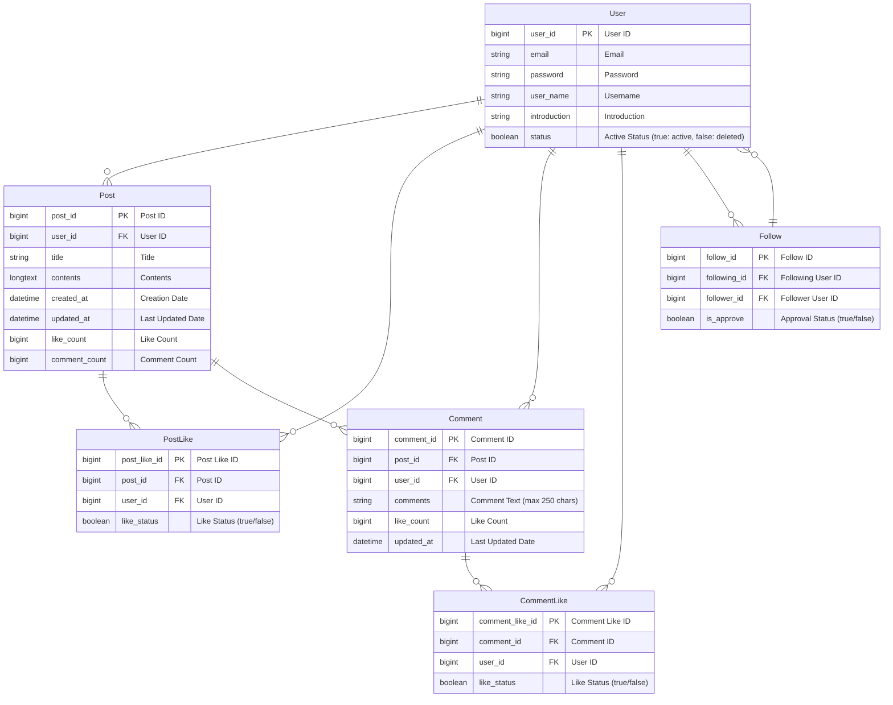

# 🗓️ News Feed Project

---------------------------

## ❔프로젝트 정보
- Spring, JPA, 3 Layer Architecture를 활용한 'News Feed' 협업 프로젝트 입니다.<br>
- 기본적인 유저 관리, 뉴스피드 게시물 및 댓글 관리, 좋아요, 팔로우/팔로잉 기능을 구현하였습니다.<br>
- **개발기간**: 24.12.20 ~ 24.12.27

### ✒️App 이름

- ```ShareDay```
- 매일의 일상을 서로 공유한다는 의미에서 ShareDay라고 지었습니다.

### 🔷 주요 기능

- 유저 관리, 게시글 관리, 팔로워 관리 기능

### 🔷 부가 기능

- 댓글, 좋아요, 기간별 게시물 조회 기능

## 🔧사용 기술
### **Environment**


### **Development**

 


--------------------
## 📚 ERD



--------------------
# 📋 API 명세서

## 📍1. 회원 관련 API
### UserController
| 기능       | Method   | URL              | Request |
|----------|----------|------------------|---------|
| 회원 가입    | `POST`   | /users/signup    | Body    |
| 회원 탈퇴    | `DELETE` | /users/{user_id} | Body    |
| 회원 정보 수정 | `PATCH`  | /users/{user_id} | Body    |
| 로그인      | `POST`   | /users/login     | Body    |
| 로그아웃     | `POST`   | /users/logout    | -       |

### HttpStatus

| 상태                                       | 응답               |
|------------------------------------------|------------------|
| 회원 생성 성공                                 | 201 Created      |
| 수정, 조회, 삭제 성공                            | 200 OK           |
| 삭제된 회원, 중복 이메일, 삭제된 이메일, 변경 비밀번호가 이전과 동일 | 400 Bad Request  |
| 미인증 회원, 비밀번호 불일치                         | 401 Unauthorized |
| URL 오류                                   | 404 Not Found    |

<br>

## **1.1 회원가입**
### 🔹**POST** `/users`
- SignUpRequestDto

| 필드명            | Type     | Description              | 필수 여부 |
|----------------|----------|--------------------------|-------|
| email          | `String` | `unique`, 최대 50 자        | ✔️    |
| password       | `String` | 8자 이상, '영문, 숫자, 특수문자' 포함 | ✔️    |
| renterPassword | `String` | -                        | ✔️    |
| userName       | `String` | 10자 이내                   | ✔️    |


### 🔹RequestBody
```json
{
  "email": "string",
  "password": "string",
  "renterPassword": "string",
  "userName": "string"
}
```
### 🔹ResponseBody
```json
{
  "message": "String"
}
```
<br>

## **1.2 회원 탈퇴**
### 🔹**DELETE** `/users/{user_id}`

- CancelRequestDto

| 필드명            | Type     | Description | 필수 여부 |
|----------------|----------|-------------|-------|
| password       | `String` | -           | ✔️    |
| renterPassword | `String` | -           | ✔️    |

### 🔹RequestBody
```json
{
  "password": "string",
  "renterPassword": "string"
}
```
### 🔹ResponseBody
```json
{
  "message": "String"
}
```
<br>

## **1.3 회원 정보 수정**
### 🔹**PATCH** `/users/{user_id}`

- UpdateUserInfoRequestDto

| 필드명            | Type     | Description | 필수 여부 |
|----------------|----------|-------------|-------|
| password       | `String` | 공백 입력 불가    | -     |
| renterPassword | `String` | 공백 입력 불가    | -     |
| userName       | `String` | 10자 이내      | -     |

### 🔹RequestBody
```json
{
  "password": "string",
  "renterPassword": "string",
  "userName": "String"
}
```
### 🔹ResponseBody
```json
{
  "message": "String"
}
```
<br>

## **1.4 로그인**
### 🔹**POST** `/users/login`

- LoginRequestDto

| 필드명      | Type     | Description | 필수 여부 |
|----------|----------|-------------|-------|
| password | `String` | 공백 입력 불가    | ✔️    |
| email    | `String` | 공백 입력 불가    | ✔️    |

### 🔹RequestBody
```json
{
  "email": "String",
  "password": "String"
}
```
### 🔹ResponseBody
```json
{
  "message": "String"
}
```
<br>

## **1.5 로그아웃**
### 🔹**POST** `/users/logout`
### 🔹ResponseBody
```json
{
  "message": "String"
}
```
<br>

---------------------

## 📍2. 프로필 관련 API
### profileController
| 기능       | Method | URL                      | Request |
|----------|--------|--------------------------|---------|
| 자기 소개 수정 | `PUT`  | /users/profile/{user_id} | Body    |
| 프로필 조회   | `GET`  | /users/profile/{user_id} | -       |

### HttpStatus

| 상태                 | 응답               |
|--------------------|------------------|
| 수정, 조회 성공          | 200 OK           |
| 미인증 회원             | 401 Unauthorized |
| URL 오류, 존재하지 않는 회원 | 404 Not Found    |

<br>

## **2.1 자기 소개 수정**
### 🔹**PUT** `/users/profile/{user_id}`
- ProfileUpdateRequestDto

| 필드명          | Type     | Description | 필수 여부 |
|--------------|----------|-------------|-------|
| introduction | `String` | -           | -     |

### 🔹RequestBody
```json
{
  "introduction": "string"
}
```
### 🔹ResponseBody
```json
{
  "introduction": "string"
}
```
<br>

## **2.2 프로필 조회**
### 🔹**GET** `/users/profile/{user_id}`

### 🔸RequestHeader
```
pageNum = Number
```
### 🔹ResponseBody
```json
{
    "userName": "String",
    "introduction": "String",
    "followingNum": "Long",
    "introduction": "Long",
    "posts": "List<PostPage>"
}
```
--------------------

## 📍3. 팔로우 관련 API
### FollowController
| 기능     | Method   | URL                                | Request |
|--------|----------|------------------------------------|---------|
| 팔로잉    | `POST`   | /users/follow/{user_id}            | -       |
| 팔로잉 취소 | `DELETE` | /users/follow/{user_id}            | -       |
| 팔로워 목록 | `GET`    | /users/follow/{user_id}/followers  | -       |
| 팔로잉 목록 | `GET`    | /users/follow/{user_id}/followings | -       |

### HttpStatus

| 상태                    | 응답              |
|-----------------------|-----------------|
| 팔로잉, 팔로잉 취소, 목록 조회 성공 | 200 OK          |
| 팔로우 관계가 존재하지 않음       | 400 Bad Request |
| URL 오류, 존재하지 않는 회원    | 404 Not Found   |
| 이미 팔로우 된 상태, 본인을 팔로우  | 409 Conflict    |

<br>


## **3.1 팔로잉**
### 🔹**POST** `/users/follow/{user_id}`
### 🔹ResponseBody
```json
{
  "message": "String"
}
```

## **3.2 팔로잉 취소**
### 🔹**DELETE** `/users/follow/{user_id}`
### 🔹ResponseBody
```json
{
  "message": "String"
}
```

## **3.3 팔로워 목록 조회**
### 🔹**GET** `/users/follow/{user_id}/followers`
### 🔹ResponseBody
```json
[
    {
        "userName": "String",
        "follwers": "List<FollowUserInfoDto>"
    }
]
```

## **3.4 팔로잉 목록 조회**
### 🔹**GET**`/users/follow/{user_id}/followings`
### 🔹ResponseBody
```json
[
    {
        "userName": "String",
        "followings": "List<FollowUserInfoDto>"
    }
]
```
----------------------

## 📍4. 게시글 관련 API
### PostController
| 기능         | Method   | URL                    | Request |
|------------|----------|------------------------|---------|
| 게시물 생성     | `POST`   | /feed                  | Body    |
| 게시물 수정     | `PATCH`  | /feed/{post_id}        | Body    |
| 게시물 삭제     | `DELETE` | /feed/{post_id}        | -       |
| 게시물 전체 조회  | `GET`    | /feed/page/{page}      | Head    |
| 게시물 기간별 조회 | `GET`    | /feed/dateRange/{page} | -       |
| 게시물 단건 조회  | `GET`    | /feed/{post_id}        | -       |
| 친구 게시물 조회  | `GET`    | /feed/follower/{page}  | Head    |

### HttpStatus

| 상태                  | 응답               |
|---------------------|------------------|
| 회원 생성 성공            | 201 Created      |
| 게시물 수정, 조회 성공       | 200 OK           |
| 게시물 삭제 성공           | 204 No Content   |
| 미인증 회원, 비밀번호 불일치    | 401 Unauthorized |
| URL 오류, 존재하지 않는 게시글 | 404 Not Found    |

<br>

## **4.1 게시물 생성**
### 🔹**POST** `/feed`
- CreatedPostRequestDto

| 필드명      | Type     | Description | 필수 여부 |
|----------|----------|-------------|-------|
| title    | `String` | -           | -     |
| contents | `String` | -           | -     |

### 🔹RequestBody
```json
{
    "title": "String",
    "contents": "String"
}
```
### 🔹ResponseBody
```json
{
  "userName": "String",
  "title": "String",
  "contents": "String",
  "updatedAt": "DateTime"
}
```
<br>

## **4.2 게시물 수정**
### 🔹**PATCH** `/feed/{post_id}`
- UpdatedPostRequestDto

| 필드명      | Type     | Description | 필수 여부 |
|----------|----------|-------------|-------|
| title    | `String` | -           | -     |
| contents | `String` | -           | -     |

### 🔹RequestBody
```json
{
    "title": "String",
    "contents": "String"
}
```
### 🔹ResponseBody
```json
{
  "userName": "String",
  "title": "String",
  "contents": "String",
  "updatedAt": "DateTime"
}
```
<br>

## **4.3 게시물 삭제**
### 🔹**DELETE** `/feed/{post_id}`
<br>

## **4.4 게시물 전체 조회**
### 🔹**GET**`/feed/page/{page}`

- 팔로잉한 사람들 포스트 함께 조회
- 정렬기준:
  1. 수정일 기준 내림차순 (최신 피드가 제일 상단에 위치)
  2. 좋아요 기준 내림차순 (최신 피드 중에서 좋아요가 제일 많은 피드가 상단에 위치)
 
### 🔸RequestHeader
```
orderBy=updateAt, likeCount
```
### 🔹ResponseBody
```json
{
  "post": [
  {
    "title": "Stirng",
    "content": "String",
    "userName": "String",
    "updated_at": "DateTime"
  }
]
}
```
<br>

## **4.5 게시물 기간별 조회**
### 🔹**GET**`/feed/dateRange/{page}`
- PostFindByDateRangeRequestDto

| 필드명       | Type            | Description | 필수 여부 |
|-----------|-----------------|-------------|-------|
| startDate | `LocalDateTime` | -           | -     |
| endDate   | `LocalDateTime` | -           | -     |
| orderBy   | `String`        | -           | -     |

### 🔹RequestBody
```json
{
  "startDate":"DateTime",
  "endDate":"DateTime",
  "orderBy":"String"
}
```
### 🔹ResponseBody
```json
{
  "userName": "String",
  "title": "String",
  "contents": "String",
  "updatedAt": "DateTime"
}
```
<br>

## **4.6 게시물 단건 조회**
### 🔹**GET**`/feed/{post_id}`

### 🔹ResponseBody
```json
{
  "userName": "String",
  "title": "String",
  "contents": "String",
  "updatedAt": "DateTime"
}
```
<br>

## **4.7 팔로우 피드 조회**
### 🔹**GET**`/feed/follower/{page}`
### 🔸RequestHeader
```
orderBy=updateAt, likeCount
```
### 🔹ResponseBody
```json
{
  "post": [
    {
      "title": "Stirng",
      "content": "String",
      "userName": "String",
      "updated_at": "DateTime"
    }
  ]
}
```
<br>

--------------------------------

## 📍5. 댓글 관련 API
### PostController
| 기능         | Method   | URL                                   | Request |
|------------|----------|---------------------------------------|---------|
| 댓글 생성      | `POST`   | /feed/{post_id}/comments              | Body    |
| 댓글 수정      | `PATCH`  | /feed/{post_id}/comments/{comment_id} | Body    |
| 댓글 조회      | `GET`    |                                       |         |
| 댓글 삭제     | `DELETE` | /feed/{post_id}                       | -       |

### HttpStatus

| 상태                  | 응답               |
|---------------------|------------------|
| 회원 생성 성공            | 201 Created      |
| 게시물 수정, 조회 성공       | 200 OK           |
| 게시물 삭제 성공           | 204 No Content   |
| 미인증 회원, 비밀번호 불일치    | 401 Unauthorized |
| URL 오류, 존재하지 않는 게시글 | 404 Not Found    |

<br>

## **4.1 게시물 생성**
### 🔹**POST** `/feed`
- CreatedPostRequestDto

| 필드명      | Type     | Description | 필수 여부 |
|----------|----------|-------------|-------|
| title    | `String` | -           | -     |
| contents | `String` | -           | -     |

### 🔹RequestBody
```json
{
    "title": "String",
    "contents": "String"
}
```
### 🔹ResponseBody
```json
{
  "userName": "String",
  "title": "String",
  "contents": "String",
  "updatedAt": "DateTime"
}
```
<br>


---

### 3. 댓글 관리
#### **3.1 댓글 추가**
**POST** `/feed/{post_id}/comments`
```json
{
    "comments": "string"
}
```
- **응답**: `201 Created`

#### **3.2 게시물 댓글 조회**
**GET** `/feed/{post_id}/comments`
- **응답**:
```json
[
    {
        "commnets": "String",
        "like": "Long",
        "userName": "String",
        "updateAt": "datetime"
    }
]
```

#### **3.2 게시물 댓글 수정**
**GET** `/feed/{post_id}/comments/{comment_id}`
```json
[
    {
        "commnets": "String"
    }
]
```
- **응답**:
```json
[
    {
        "commnets": "String",
        "like": "Long",
        "userName": "String",
        "updateAt": "datetime"
    }
]
```

#### **3.3 댓글 삭제**
**DELETE** `/feed/{post_id}/comments/{comment_id}`
- **응답**: `200 OK`

---

### 4. 좋아요 관리
#### **4.1 게시물 좋아요/취소**
**POST** `/posts/{post_id}/likes`
```json
{
    "user_id": "integer",
    "like_status": "boolean"
}
```
- **응답**: `200 OK`

#### **4.2 댓글 좋아요/취소**
**POST** `/feed/{post_id}/comments/{commnet_id}/{user_id}/like`
- **응답**:
```json
{
    "LikeNum": "Long"
}
```
---


---

### 데이터 모델 개요
- **User**: 플랫폼 사용자를 나타냅니다.
- **Post**: 사용자가 작성한 게시물을 나타냅니다.
- **Comment**: 게시물에 대한 사용자의 댓글을 나타냅니다.
- **PostLike**: 게시물에 대한 좋아요를 추적합니다.
- **CommentLike**: 댓글에 대한 좋아요를 추적합니다.
- **Follow**: 사용자 간의 팔로우 관계를 추적합니다.
